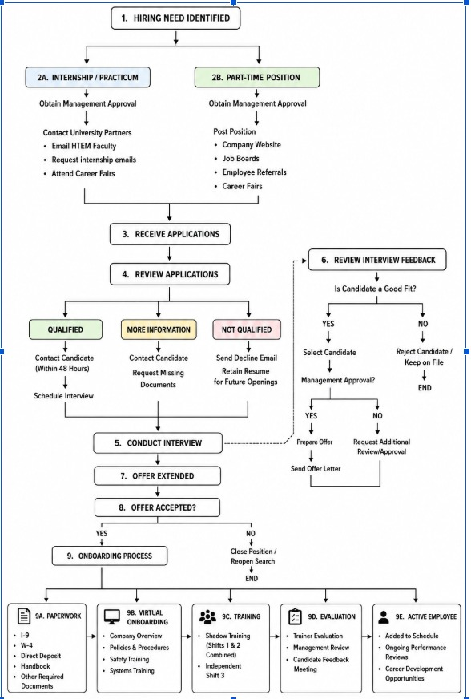
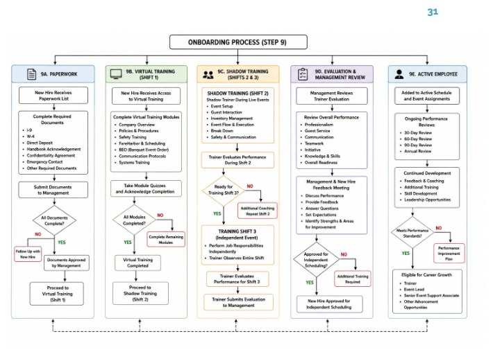

# The Onboarding System — What It Actually Is and How to Build It

*Written Aug 5, 2026. Sources: Raisa's "2026 Event Support Handbook Proposal", the Aug 4 meeting with Raisa + Dave, the follow-up call with Dave alone, and the two workflow charts.*

---

## 1. The one-paragraph answer

Mangia DC hires event staff over and over: find candidates at university career fairs and job boards, interview them, hire them, make them do paperwork, make them watch training videos, put them through three supervised shifts, evaluate them, and then let them work independently. That whole process currently lives in a **Google Doc** — Raisa's handbook. Dave does **not** want you to build a document viewer. He wants that process turned into a **clickable tool inside the CRM**: every box in the workflow chart becomes a step in the app, each step carries the exact link/email/video/checklist needed to do it, and each new hire is tracked as they move through the steps. That's the system.

> **Dave's exact ask (first meeting, 00:15:11):** "Ali needs to be able to source this document to know where everything is… so that when someone is going through the steps of the process, that said someone can click to those respective places rather than like need to go through a document."

### Who gets CRM credentials (requirement)

**Dave:** the tool is for **employees**. People get credentials **after they are hired**.

| Stage | CRM login? |
|-------|------------|
| Applicant / candidate (recruitment, interview, offer) | **No** — managers track them in the tool; they never log in |
| Hired (paperwork / training / active staff) | **Yes** — credentials issued after hire |

So: no applicant portal, no invite-before-offer flow. Recruitment and early onboarding are **internal** (staff ticking steps, attaching links, chasing paperwork). Account creation is a **post-hire** step, not part of the candidate pipeline.

---

## 2. Why you're confused (three different things got handed to you as one)

Raisa gave you a single file, but it contains **three separate kinds of things**, and they need three different treatments. This is the main source of the confusion.

| # | What it is | Example from the doc | What you do with it |
|---|-----------|---------------------|---------------------|
| 1 | **Handbook content** — policies, rules, expectations | Dress code, confidentiality, emergency response, guest interaction | Reference material. Store it, make it searchable/linkable. Do **not** turn it into workflow steps. |
| 2 | **Process** — the ordered steps of hiring and onboarding | Phases 1–6, the two workflow charts | **This is the system.** Becomes steps, owners, statuses, gates. |
| 3 | **Resources** — the things a step needs | GMU career fair link, Dr. Min Park's email, the 3 training videos, the evaluation checklist, the example outreach email | Becomes attachments hanging off steps. This is what makes it "clickable". |

The handbook mixes all three together because it's a handbook. Your job is to pull #2 out as the skeleton and hang #1 and #3 off it.

**Second source of confusion:** Raisa's document covers **one job role out of four**. More on that in §6.

---

## 3. Who's who

| Person | Role in the process |
|--------|--------------------|
| **Dave** (Mangia DC) | Owner. Final approval on offers. Defines what the tool must do. Owes you material for the other 3 roles. |
| **Raisa** | Intern who wrote the handbook + workflow charts as her special project. Also an Event Lead. **Her internship ends Friday Aug 7** — she's your only source on this document after that. |
| **Zach Finch** | Manager. Conducts interviews, sends the post-video Q&A, reviews trainer evaluations. |
| **Belle** | Contacts qualified candidates within 48 hours, schedules interviews, sends reminders. |
| **Trainer** | A senior team member (not Zach) who supervises training shifts 2 and 3 and fills out the evaluation. Gets extra pay. |
| **You** | "Mr. Toolman." Building the thing. |

---

## 4. What you actually have right now

### You have
- The handbook: policies, paperwork list, training structure, evaluation criteria, team structure, scheduling/invoicing rules.
- GMU recruitment detail: two career fairs, TOUR 241 practicum (120 hrs), TOUR 490 internship (400 hrs), four named faculty/career-services contacts, a month-by-month recruitment timeline.
- Two workflow charts (see §5).
- Three training videos on Google Drive: `Fareharbor&BEO.mp4`, `InvoiceTemplate.mp4`, `Mangia Structure.mp4`. You already have access.

### You're missing (this matters — it's your question list)
- **The post-video questionnaire.** Raisa's doc crashed while she was adding it; she said she'd add it right after the meeting. Not in the file yet.
- **Interview questions.** Raisa explicitly said she doesn't have access to these — management does. Ask Dave.
- **Video 3** ("Basic event workflow / safety procedures") — listed in the handbook with no link. Doesn't appear to exist yet.
- **Job board list.** Dave said Indeed + employee referrals + university; explicitly *not* LinkedIn for this role. Raisa didn't know where the company posts.
- **The university email blast process** — the handbook literally has a placeholder in caps: *"INSERT DETAIL ON THE INTERNAL EMAIL BLAST… WHAT IS THE PROCESS? WHO DO YOU REACH OUT TO?"*
- **Everything for the other three roles** (§6).

### Explicitly cut
- **Floor plans.** Raisa: they're leftovers from her internship, not needed. Decision recorded in the meeting notes.

---

## 5. How the process works (walking the charts)

### Chart 1 — the whole thing, hiring need → active employee



Read it as **eight steps then a fork**:

1. **Hiring need identified** — a manager decides more staff are needed (seasonal demand, event load, or an internship slot).
2. **Split by hire type.** Left branch = **internship / practicum** (contact university partners, email HTEM faculty, request internship emails, attend career fairs). Right branch = **part-time position** (post on company website, job boards, employee referrals, career fairs). Both need management approval first. Dave: *"We're going to do a lot more on the right hand side than the left."*
3. **Receive applications.**
4. **Review applications** → three outcomes:
   - **Qualified** → Belle contacts within **48 hours** → schedule interview.
   - **More information** → request the missing documents.
   - **Not qualified** → send decline email, **but keep the resume in the repository** for future openings, with a recorded reason. Dave wants those reasons captured as structured fields: *"here are the things that recruiter needs to fill out so that we can keep a flowing repository."*
5. **Conduct interview** — Zach.
6. **Review interview feedback** — is this candidate a good fit? If yes, Zach passes the candidate (with their availability) to Dave for **secondary approval**. If no, reject and keep on file.
7. **Offer extended.**
8. **Offer accepted?** No → close/reopen the position. Yes → onboarding.
9. **Onboarding**, which splits into 9A–9E: Paperwork → Virtual Onboarding → Training → Evaluation → Active Employee.

### Chart 2 — step 9 exploded



This is the part that becomes checklists with hard gates. Each column blocks the next:

- **9A Paperwork** — I-9, W-4, direct deposit, handbook acknowledgment, confidentiality agreement, emergency contact, plus W-9 / contractor agreement for 1099s. Loop: not all documents complete → follow up with new hire. Only when management approves does the hire proceed.
- **9B Virtual Training (Shift 1)** — watch the modules (FareHarbor/BEO, invoice template, company structure, safety), take the **completion quiz**, and Zach confirms. Loop: modules incomplete → complete remaining modules.
- **9C Shadow Training (Shifts 2 & 3)** — Shift 2: shadow an experienced team member for a full event (setup, guest interaction, inventory, event flow, breakdown, safety), paid at training rate. Trainer evaluates. Not ready → **additional coaching, repeat shift 2**. Ready → Shift 3: perform the role independently at standard pay while the trainer observes the entire shift. Trainer submits the evaluation to management.
- **9D Evaluation & Management Review** — management reviews the trainer's evaluation on professionalism, guest service, teamwork, communication, initiative, knowledge, overall readiness. Then a new-hire feedback meeting. Approved → independent scheduling. Not approved → additional training.
- **9E Active Employee** — added to the schedule and event assignments; 30/60/90-day and annual reviews; growth path to Trainer → Event Lead → Senior Event Support Associate. Below standard → performance improvement plan.

### Two things to be careful about

**The shift numbering contradicts itself between the charts.** Chart 1 (9C) says "Shadow Training (Shifts 1 & 2 Combined)" and "Independent Shift 3." Chart 2 says virtual training is Shift 1, shadow is Shift 2, independent is Shift 3. Chart 2 matches both the handbook body text and what Raisa said out loud in the meeting (*"9B which is the virtual onboarding, that is considered actually shift one"*). **Chart 2 is right; Chart 1 is the outdated one** — Raisa flagged that pages 31–32 were stale and 33 was current. Confirm with her before Friday, then build to Chart 2.

**Two changes were agreed in the meeting but aren't in the document yet:**
- Add **"university email blast"** as a recruitment bullet on the part-time side (email department chairs, they forward to students; can be sent repeatedly through the year, and can cover internships and part-time in one email).
- Add the **post-video questionnaire** to verify the videos were actually watched. Raisa's example: *"what is the name of this company?"*

---

## 6. The thing Dave told you in the second call — there are four roles, not one

This is the single most important architectural constraint, and it only came up in the follow-up call.

> **Dave:** "There's three different kinds of positions… Raisa is covering the operation support associate position… But there's other roles as well, which is the event team lead. There's also a culinary instructor. And then there's also a food tour guide."

So the roles are:

| Role | Status of the material | Dave's commitment |
|------|----------------------|-------------------|
| **Event Support Associate** (a.k.a. Event Associate / Operations Support Associate) | Complete — Raisa's handbook | Done |
| **Event Team Lead** | Nothing yet | *"Needs the most work… I could probably tackle first"* |
| **Culinary Instructor** | Nothing yet | Harder to pull together; end of week |
| **Food Tour Guide** | Nothing yet | *"Pretty specific"*; can get it fastest; end of week |

He also warned: *"the intake is still a little different, but some of it could be the same."* Meaning the **recruitment front half varies per role** (you don't source a culinary instructor at a student career fair) while the **onboarding back half overlaps** (paperwork is paperwork).

**What this means for you:** do not hardcode Raisa's flow. The system must be **role-templated** — a workflow definition per role, sharing common pieces. If you build it hardcoded to the Event Support Associate, you will rebuild it three times.

Also note the material for the other three roles will be **much rougher** than Raisa's — she had months. Expect to shape it yourself.

---

## 7. The mental model that makes this buildable

Stop thinking "onboarding system." Think **two layers**, which is a pattern already in your codebase.

### Layer A — the Workflow Library (definition / admin side)

A **template** per role: an ordered list of steps. Each step has:

- a **phase** (Recruitment / Hiring / Paperwork / Virtual Training / Shadow Training / Evaluation / Active)
- a **type** — action, decision (yes/no branch), checklist, form, video+quiz, document collection
- an **owner** — the operational role responsible (Manager, Recruiter, Trainer, the New Hire)
- **instructions** — the prose from the handbook, inline
- **resources** — the clickable payload: links, videos, email templates, contacts, PDFs, checklists
- a **gate rule** — does this block the next step? (Paperwork does. Informal feedback doesn't.)
- an optional **SLA** — e.g. Belle's 48-hour contact rule

This is where Raisa's document goes — chopped into steps instead of pages. **Editing the process = editing this library**, not shipping code. That matters because three more roles are coming and the material will change.

### Layer B — the Candidate Journey (runtime / daily-use side)

When a real person applies, you **instantiate** the template for their role: a copy of the steps attached to that person, each with status, who completed it, when, and notes. That record is the candidate's journey from application to active employee.

### Why this is easy in your codebase

You already have this exact pattern twice:

| Existing thing | Onboarding equivalent |
|---------------|----------------------|
| `event_templates` (JSONB task arrays) → generated `tasks` per event | Workflow template → generated steps per candidate |
| Leads pipeline: `leads.stage` + kanban + `LeadStateMachine.jsx` | Recruitment pipeline: candidate stage + kanban |
| `PlanningDiscussionChecklist.jsx` (multi-step gate before stage advance) | Paperwork / video-completion gates |
| `tasks` (status, `responsible_role`, acknowledge, due date, notes) | Step instances assigned to Trainer / Manager / New Hire |
| `email_templates` + `stage_email_mappings` (stage-triggered email) | Decline email, interview invite, offer letter, availability request |
| `activity_logs` + `thread_messages` | Audit trail: who approved, who evaluated, when |

**Steps 1–8 of Chart 1 are a pipeline** — same shape as your Leads kanban. **Step 9 is checklists with gates** — same shape as your Event tasks. You are not inventing anything new; you're combining two patterns you've already shipped.

---

## 8. Concrete data model

New tables, following the existing Drizzle + entity-registry pattern:

```
job_roles                  Event Support Associate | Event Team Lead |
                           Culinary Instructor | Food Tour Guide

hire_types                 practicum (120h) | internship (400h) |
                           part-time employee | 1099 contractor

workflow_templates         one per (job_role × hire_type), versioned
workflow_steps             template steps: phase, order, title, instructions,
                           step_type, owner_role, is_gate, sla_hours

resources                  typed clickable payloads: link | video | email_template
                           | document | contact | checklist | form
step_resources             join: which resources hang off which step

candidates                 name, email, phone, job_role, hire_type, source,
                           stage, resume_url, decline_reason, retain_for_future

candidate_steps            instance of a step for a candidate: status,
                           completed_by, completed_at, notes, attachments

evaluations                trainer ratings per criterion, shift number,
                           overall readiness, management review, outcome

recruitment_campaigns      career fairs, email blasts: date, university,
                           contact, registration link, status

partner_contacts           Dr. Min Park, Tina Jones, Bernadette Davey, etc.
```

Reuse as-is: `users`, `role_assignments` (operational roles), `activity_logs`, `thread_messages`, `email_templates`.

**Where the handbook content lands:** policy sections (dress code, confidentiality, emergency response) become `resources` of type `document`, linked from the steps that need them — the handbook acknowledgment step, the virtual training step. They are reference material, not steps.

---

## 9. Screens

| Screen | Who | What it does |
|--------|-----|-------------|
| **Recruitment Pipeline** | Managers | Kanban of candidates by stage, filterable by role / source / hire type. Includes a **Hire sources** tab: advertising playbook (links, contacts, fair dates, sample copy, timeline) for every hire channel. Mirrors `Leads.jsx` for the pipeline half. |
| **Candidate Detail** | Managers | **The centerpiece.** The workflow chart rendered as a live checklist for this person: current step highlighted, every step expandable with its instructions and its clickable resources, complete/approve actions inline. This is literally what Dave asked for. |
| **Onboarding Board** | Managers, Trainers | Everyone currently in paperwork / shift 1 / 2 / 3, with what's blocking each one. |
| **Workflow Library** | Admin | Build and edit templates per role. Where you'll add the three new roles without writing code. |
| **Resource Library** | Admin | Videos, links, email templates, contacts, forms — reused across steps and roles. |
| **Recruitment Calendar** | Managers | The July→Spring timeline, career fair dates, email blast reminders, GMU contacts. |
| **Evaluations** | Trainers, Management | Submit trainer evaluation; management review and approve/repeat decision. |

Plumbing reminder from the existing codebase: a new page needs a file in `client/src/pages/`, registration in `pages.config.js`, and a manual nav entry in the arrays in `Layout.jsx`. New tables need a schema file, an export from `server/db/schema/index.ts`, an entry in `server/services/entities/registry.ts`, and an `ENTITY_MAP` entry in `client/src/api/apiClient.js` — then `npm run db:generate` and `npm run db:migrate-apply`.

---

## 10. Build order

**Phase 0 — this week (Raisa leaves Friday).** Don't build the engine yet. Build a **clickable prototype of the Event Support Associate flow** — the chart as a real screen, steps expandable, real links to the real videos and the real GMU pages. Even hardcoded. The point is to get Raisa's sign-off while she's still reachable. Dave explicitly offered this: *"If you wanted to flush out just one of these roles… get buy-in from her."*

**Phase 1 — the spine.** `candidates` + recruitment pipeline (steps 1–8). Source tracking, 48-hour SLA on Belle's contact step, decline reasons and resume retention, the Zach → Dave two-stage approval. **Status (Aug 2026): delivered** — see [`plans/12-onboarding-phase1.md`](../plans/12-onboarding-phase1.md). All four roles selectable; ESA has full checklist; other roles show Coming soon for role-specific onboarding.

**Phase 2 — onboarding runtime.** Step 9A–9E as gated checklists. Paperwork gate, video + quiz gate, shift 2 → 3 progression with the repeat-shift loop, trainer evaluation, management review.

**Phase 3 — templating.** Lift the hardcoded flow into the Workflow Library, then load Event Team Lead / Culinary Instructor / Food Tour Guide as data. If Phases 1–2 were built cleanly this is configuration, not code.

**Phase 4 — the extras.** Recruitment calendar and campaign reminders, evaluation scoring and the every-fifth-shift cadence, reporting.

---

## 11. Questions to send Dave

Your action item from the first meeting was literally "send questions to Dave." Here they are, ordered by how much they change the build.

**Architecture-defining:**
1. ~~**Do new hires log into this tool themselves, or is it internal-only?**~~ **Answered (Dave):** CRM is for employees; credentials are issued **after hire**. Candidates never get accounts. Pre-hire pipeline is manager-driven. (See §1 “Who gets CRM credentials.”)
2. **Where do documents live?** There is no file upload in the CRM today — it's stubbed and returns a 501. Options: Google Drive links, a real upload endpoint you build, or an external service (DocuSign etc.) with the tool just tracking status.
3. **Are I-9 / W-4 / W-9 filled out in the tool or outside it?** Real tax and eligibility forms have compliance and retention implications. Strong recommendation: track status only, don't collect them in-app.

**Process:**
4. Do Belle, Zach, and Monica need accounts? Which operational roles map to them?
5. Interview questions — Raisa doesn't have them, she said management does. Can you send them?
6. Video 3 (basic event workflow / safety) doesn't exist. Who records it?
7. Which job boards, exactly? Does the tool just record where a candidate came from, or is it supposed to help post?
8. Is the offer letter generated and sent from the tool, or handled outside it?
9. Evaluation scoring — Raisa said the passing threshold is "up to management." What is it?
10. The every-fifth-shift evaluation cadence needs shift counts. Does that come from FareHarbor, or is it entered manually?
11. Practicum/internship hour tracking (120 / 400) and the employer evaluation the university requires — in scope?
12. Multi-university: GMU is the model, but you mentioned American University too. Should universities be data (each with its own fairs, contacts, timeline), or is GMU enough for v1?

**Timeline:**
13. Confirming the three other role packets — Event Team Lead first, then Food Tour Guide and Culinary Instructor by end of week.

## 12. Questions to send Raisa (before Friday Aug 7)

1. The post-video questionnaire — you said you'd add it after the meeting. Can you send it?
2. Shift numbering: Chart 2 says virtual = Shift 1, shadow = Shift 2, independent = Shift 3, and Chart 1 disagrees. Confirming Chart 2 is correct?
3. The page catalog / page numbers you offered to add.
4. The example university outreach emails — which page, and is there one for internships and one for part-time?
5. Confirming floor plans are out.
6. The evaluation checklist and the manager feedback form (handbook pages 17–18) — are those images or is there a text version I can turn into fields?

---

## 13. Glossary

| Term | Meaning |
|------|---------|
| **BEO** | Banquet Event Order — the per-event spec sheet (timeline, guest count, dietary needs, special requests). Staff must read it before every event. |
| **FareHarbor** | The scheduling platform. Staff view shifts and event details there. Monthly availability → monthly schedule, distributed ~10 days before month start. |
| **Practicum (TOUR 241)** | GMU course: 120 hours over 10–14 weeks. Unpaid. Requires a faculty supervisor and an agency supervisor, verified hours, and an employer evaluation. |
| **Internship (TOUR 490)** | GMU course: 400 hours, 30–40 hrs/week in summer. Advanced work, final presentation. |
| **HTEM** | GMU's Hospitality, Tourism & Events Management department — the target department for recruiting. |
| **Shift 1 / 2 / 3** | Virtual training / shadow an experienced member / work independently with a trainer observing. |
| **Trainer** | Senior team member picked by management (no formal application process) to supervise training shifts, for a pay differential. |
| **Event Lead** | On-site leader: pre-event briefing, assigns responsibilities, primary client contact. |
| **"Base 44"** | What Dave and Raisa call the software you're building. In practice it's this CRM — a React + Express app whose API layer mimics the Base44 SDK. |

---

## 14. The short version

- Raisa's handbook is **content and process**, not a system.
- Dave wants the **workflow chart to become the interface** — steps you click through, with the exact link/video/template/form attached to each one.
- The flow is: **pipeline** for steps 1–8 (like your Leads kanban), **gated checklists** for step 9 (like your Event tasks).
- Build it **template-driven**, because three more roles are coming and only one is documented.
- **Get a clickable prototype of the Event Support Associate flow in front of Raisa before Friday**, because after that the only person who understands the source document is gone.
