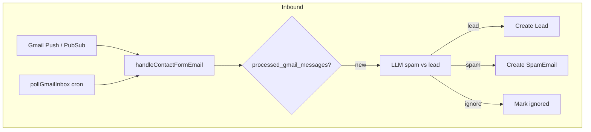

# 03 — Gmail & Email

Replace Base44 Gmail connector and all email-related functions with **Google Gmail API** via `googleapis` package.

## Base44 Gmail scopes (from connector)

```
gmail.readonly
gmail.compose
gmail.send
email
```

## Frontend functions to replace

| Function | Purpose |
|----------|---------|
| `syncGmailEmails` | Fetch messages for a lead's email address |
| `getEmailDetail` | Full message body by Gmail message ID |
| `getDraftDetail` | Gmail draft by draft ID |
| `createGmailDraft` | Create draft with template variables |
| `sendGmailEmail` | Send email (or send existing draft) |
| `replyToEmail` | Reply in thread |
| `logLeadEmailActivity` | Log email thread activity on lead |
| `getInboxEmails` | Inbox listing (if used by background jobs) |
| `getSentEmails` | Sent listing |

## Background functions (Gmail)

| Function | Purpose |
|----------|---------|
| `pollGmailInbox` | Safety-net poller for contact form emails |
| `handleContactFormEmail` | Webhook: new contact form submission |
| `extractLeadFromEmail` | LLM: parse email → lead fields |
| `sendStageEmail` | Auto-send template on stage change |
| `sendSurveyEmailOnNoAnswer` | Survey after no-answer call |
| `handleMeetingConfirmationReply` | Parse reply to meeting proposal |

## OAuth setup

### Google Cloud Console

1. Create OAuth 2.0 credentials (Web application)
2. Redirect URI: `http://localhost:5000/api/gmail/oauth/callback` (dev)
3. Enable Gmail API

### Env vars

```env
GOOGLE_CLIENT_ID=
GOOGLE_CLIENT_SECRET=
GOOGLE_REDIRECT_URI=http://localhost:5000/api/gmail/oauth/callback
GMAIL_SENDER_EMAIL=crm@mangia.com
```

### Token storage

New table `gmail_connections` (or extend `automation_config`):

```sql
gmail_connections (
  id uuid PK,
  user_id uuid FK users,        -- who connected (admin)
  access_token text encrypted,
  refresh_token text encrypted,
  expires_at timestamptz,
  email varchar,
  created_date, updated_date
)
```

Use one **service account** or **shared mailbox** OAuth for CRM sending (admin connects once).

## API routes

```
GET    /api/gmail/oauth/start          Redirect to Google consent
GET    /api/gmail/oauth/callback       Store tokens
GET    /api/gmail/status               { connected: boolean, email }

POST   /api/gmail/sync                 { lead_email }  → syncGmailEmails
GET    /api/gmail/messages/:id         → getEmailDetail
GET    /api/gmail/drafts/:id           → getDraftDetail
POST   /api/gmail/drafts               → createGmailDraft
POST   /api/gmail/send                 → sendGmailEmail
POST   /api/gmail/reply                → replyToEmail
POST   /api/gmail/log-activity         { lead_id } → logLeadEmailActivity
```

Alternatively mount under `/api/functions/*` for drop-in compatibility during migration.

## Service layer

```
server/services/gmail/
├── gmailClient.ts       # googleapis wrapper, token refresh
├── messages.ts          # list, get, search
├── drafts.ts            # create, get, send draft
├── send.ts              # compose + send
├── templates.ts         # {{name}}, {{company}} variable substitution
└── sync.ts              # sync lead thread
```

### Template variables (from EmailTemplate.body)

`{{name}}`, `{{company}}`, `{{event_type}}`, `{{preferred_date}}`, `{{headcount}}`, `{{phone}}`

Implement in `templates.ts` using lead record fields.

## Inbound email pipeline



### Idempotency

Use `processed_gmail_messages` table (already in schema):
- Key: `gmail_message_id`
- Status: `lead` | `spam` | `ignored`
- Source: `webhook` | `poller`

### Gmail push notifications (production)

1. Google Cloud Pub/Sub topic
2. `POST /webhook/gmail` receives push
3. Fetch history since `gmail_poll_state.last_history_id`

For MVP: **cron poller only** (`pollGmailInbox` every 5–15 min).

## Stage email automations

Frontend: `StageEmailMapping` + `EmailTemplate` with `send_automatically`.

On lead stage change (in Lead service hook):

1. Find active `stage_email_mappings` for stage + channel
2. Pick matching `email_templates` by category
3. Call `sendStageEmail` logic: render template, send or create draft per `send_mode`

## Email UI pages

| Page | API needs |
|------|-----------|
| `Email.jsx` | sync, lead list, templates |
| `LeadEmailDraft.jsx` | getEmailDetail, createGmailDraft, sendGmailEmail |
| `EmailViewModal.jsx` | getEmailDetail, replyToEmail |
| `CreateDraftDialog.jsx` | createGmailDraft, sendGmailEmail |
| `PipelineEmailAutomations.jsx` | EmailTemplate + StageEmailMapping CRUD |

## Spam detection

`extractLeadFromEmail` / contact form handler uses LLM to set `ai_flag_category` on leads.

Reuse OpenAI (or similar) with prompt from Base44 `extractLeadFromEmail/entry.ts`.

## Error handling

- Token expired → auto-refresh via refresh_token
- Refresh fails → `GET /api/gmail/status` returns `connected: false`; UI prompts reconnect
- Gmail API quota → exponential backoff in poller

## Dependencies

```bash
npm install googleapis
```

## Files to create

```
server/routes/gmail.ts
server/routes/webhooks/gmail.ts
server/services/gmail/*
server/db/schema/gmail-connections.ts
server/jobs/pollGmailInbox.ts
```

## Verification

- [ ] Admin can OAuth connect Gmail
- [ ] `syncGmailEmails` returns messages for lead email
- [ ] Send email appears in lead's Gmail thread
- [ ] Draft created with template variables replaced
- [ ] Reply stays in same thread (`threadId`)
- [ ] Contact form email creates lead or spam record
- [ ] Duplicate gmail_message_id not processed twice
