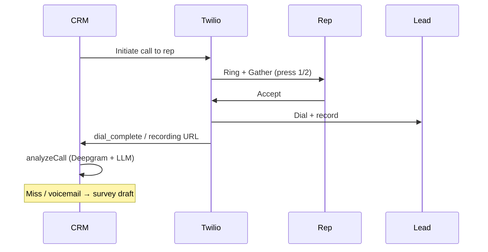

# 04 — Twilio Calls

Replace Base44 Twilio functions for automated lead calling, call logging, and transcription analysis.

## Frontend functions

| Function | Trigger |
|----------|---------|
| `triggerCallTwiML` | Manual call from Leads, LeadDetail, QueuedCallsPanel → `POST /api/calls/trigger` |
| `analyzeCall` | AutomatedCallDetail — Deepgram + LLM analysis → `POST /api/calls/:id/analyze` |

## Background / webhook functions

| Function | Purpose |
|----------|---------|
| `onLeadCreated` | Auto-call new leads → `triggerCall`; on trigger failure → survey draft |
| `twimlCallbacks` | TwiML voice/status: brief rep, dial lead, recording → `analyzeCall` |
| `sendSurveyDraftOnCallFailure` | Survey Sent Gmail draft on miss / voicemail (template-based) |
| `processScheduledCallRetries` | Cron: fire retries |
| `analyzeCall` | Deepgram nova-3 + Anthropic extract → CallLog Analyzed + Lead updates |
| `twilioBusinessProfileCallback` | Business profile status → `twilio_webhook_logs` |

## Env vars (required for live calls)

```env
TWILIO_ACCOUNT_SID=
TWILIO_AUTH_TOKEN=
TWILIO_PHONE_NUMBER=+1...
APP_URL=https://your-public-host
DEEPGRAM_API_KEY=
ANTHROPIC_API_KEY=
```

Also configure AutomationConfig `rep_phone` / `rep_email` / `calendar_link`, and seed Survey Sent email templates.

## API routes

```
POST   /api/calls/trigger                { leadId, skip_business_hours? }
POST   /api/calls/:id/analyze            Deepgram + LLM (body/query reanalyze?)

POST   /webhook/twilio/voice             TwiML callbacks (?stage=&call_log_id=)
POST   /webhook/twilio/status            Call status updates (same handler)
POST   /webhook/twilio/business-profile  → twilio_webhook_logs
```

## Call flow



### Survey draft reasons (TwiML)

| Event | Reason code |
|-------|-------------|
| `rep_gather` timeout / no digit | `rep_no_response` |
| Digits `2` | `rep_declined` |
| `rep_status` mid-call drop | `rep_line_dropped` |
| `rep_status` no-answer/busy/failed while Ringing | `rep_unreachable` |
| `dial_complete` non-completed | `lead_no_answer` |
| `analyzeCall` voicemail | `voicemail` |

`dial_complete` returns silent Hangup (no Speak).

## CallLog entity

- Create `call_logs` row on trigger with `status: Initiated`
- Update via Twilio webhooks: `Ringing`, `In Progress`, `Completed`, `No Answer`, etc.
- Store `twilio_call_sid`, `recording_url`, `transcript`
- After analysis: `status: Analyzed` + extracted_* fields

## AutomationConfig integration

- `enabled` — master switch
- `business_hours_gate_enabled` — Mon–Fri 7:30 AM–8:30 PM DC time
- `use_rep_caller_id_enabled` — rep number as caller ID
- `rep_phone`, `rep_email`, `calendar_link`
- `max_attempts`, `company_trigger_prefix`

## Deploy smoke checklist

- [x] `triggerCall` + TwiML webhooks implemented
- [x] Survey draft on all TwiML miss paths + trigger failure
- [x] Silent hangup on `dial_complete`
- [x] `analyzeCall` (Deepgram + Anthropic) + recording auto-run + API + apiClient
- [x] `POST /webhook/twilio/business-profile` → `twilio_webhook_logs`
- [ ] Set Twilio + Deepgram + `APP_URL` in env and place a test call
- [ ] Confirm recording → transcript → Analyzed on CallLog
- [ ] Confirm miss path creates Survey Sent draft + digest notify
- [ ] Confirm Trust Hub business-profile POSTs write webhook logs
- [ ] Master switch `enabled: false` blocks all calls
- [ ] AI-flagged leads skipped (`onLeadCreated`)

## Dependencies

```bash
npm install twilio
```

## Files

```
server/routes/calls.ts
server/routes/webhooks/twilio.ts
server/services/twilio/triggerCall.ts
server/services/twilio/twimlCallbacks.ts
server/services/twilio/analyzeCall.ts
server/services/twilio/businessHours.ts
server/services/leads/sendSurveyDraftOnCallFailure.ts
server/jobs/processScheduledCallRetries.ts
```
