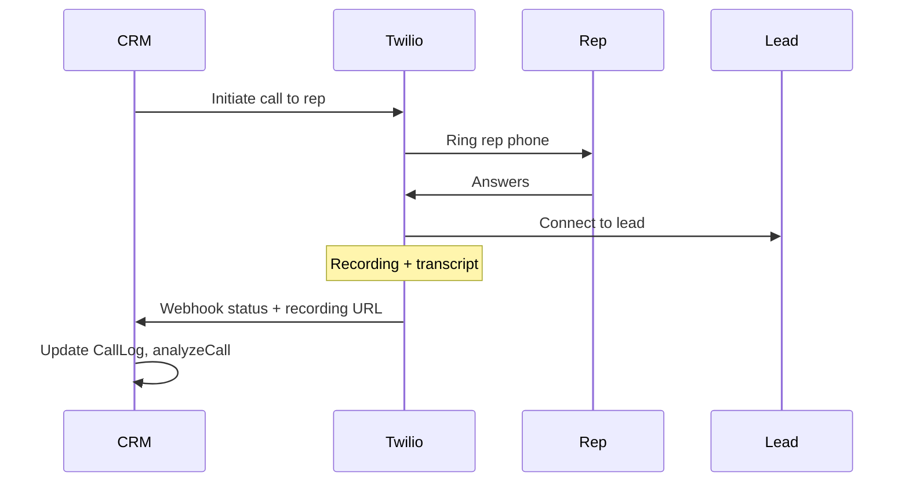

# 04 — Twilio Calls

Replace Base44 Twilio functions for automated lead calling, call logging, and transcription analysis.

## Frontend functions

| Function | Trigger |
|----------|---------|
| `triggerCallTwiML` | Manual call from Leads, LeadDetail, QueuedCallsPanel |
| `analyzeCall` | AutomatedCallDetail — LLM analysis of transcript |

## Background / webhook functions

| Function | Purpose |
|----------|---------|
| `onLeadCreated` | Auto-call new leads → invokes triggerCallTwiML |
| `twimlCallbacks` | Twilio Studio / TwiML status webhooks |
| `noAnswer` | Rep didn't answer — schedule retry |
| `processScheduledCallRetries` | Cron: fire retries |
| `sendSurveyEmailOnNoAnswer` | Email survey after no answer |
| `twilioBusinessProfileCallback` | Business profile status → TwilioWebhookLog |

## Env vars

```env
TWILIO_ACCOUNT_SID=
TWILIO_AUTH_TOKEN=
TWILIO_PHONE_NUMBER=+1...
TWILIO_STUDIO_FLOW_SID=          # if using Studio
TWILIO_BUSINESS_PROFILE_SID=
```

## API routes

```
POST   /api/calls/trigger              { lead_id, skip_business_hours? }
POST   /api/calls/:id/analyze            Run LLM analysis on transcript
GET    /api/calls/queued               Queued/retry calls for dashboard

POST   /webhook/twilio/voice             TwiML callbacks
POST   /webhook/twilio/status            Call status updates
POST   /webhook/twilio/business-profile  → TwilioWebhookLog
```

Compatibility alias: `POST /api/functions/trigger-call-twiml`

## Call flow



## CallLog entity

CRUD via entity API. Additional logic:

- Create `call_logs` row on trigger with `status: Initiated`
- Update via Twilio webhooks: `Ringing`, `In Progress`, `Completed`, `No Answer`, etc.
- Store `twilio_call_sid`, `recording_url`, `transcript`

## AutomationConfig integration

From `automation_config` table:

- `enabled` — master switch
- `business_hours_gate_enabled` — Mon–Fri 7:30 AM–8:30 PM DC time
- `use_rep_caller_id_enabled` — rep number as caller ID
- `rep_phone`, `rep_email`
- `max_attempts` — per lead
- `company_trigger_prefix` — ALITEST prefix trigger
- `calendar_link` — in no-answer email

Read config in `triggerCall` service before placing call.

## analyzeCall

Input: `{ call_log_id }` or transcript text.

Output (stored on `call_logs`):

- `summary`
- `extracted_budget`, `extracted_headcount`, `extracted_timing`
- `extracted_next_stage`
- `extracted_notes`
- `status: Analyzed`

Use OpenAI with prompt from Base44 `analyzeCall/entry.ts`.

## Queued calls panel

`QueuedCallsPanel.jsx` updates `call_logs` and re-triggers with `skip_business_hours: true`.

## Business hours

Implement `isWithinBusinessHours()` — America/New_York, Mon–Fri 7:30–20:30.

If outside hours and gate enabled: set `scheduled_retry_at` on call log instead of calling.

## Dependencies

```bash
npm install twilio
```

## Files to create

```
server/routes/calls.ts
server/routes/webhooks/twilio.ts
server/services/twilio/triggerCall.ts
server/services/twilio/twiml.ts
server/services/twilio/analyzeCall.ts
server/services/twilio/businessHours.ts
server/jobs/processScheduledCallRetries.ts
```

## Verification

- [ ] Trigger call creates CallLog and rings rep
- [ ] Webhook updates status through lifecycle
- [ ] No-answer schedules retry
- [ ] `analyzeCall` populates extracted fields
- [ ] Master switch `enabled: false` blocks all calls
- [ ] AI-flagged leads skipped (onLeadCreated)
- [ ] TwilioWebhookLog written on business profile callback
