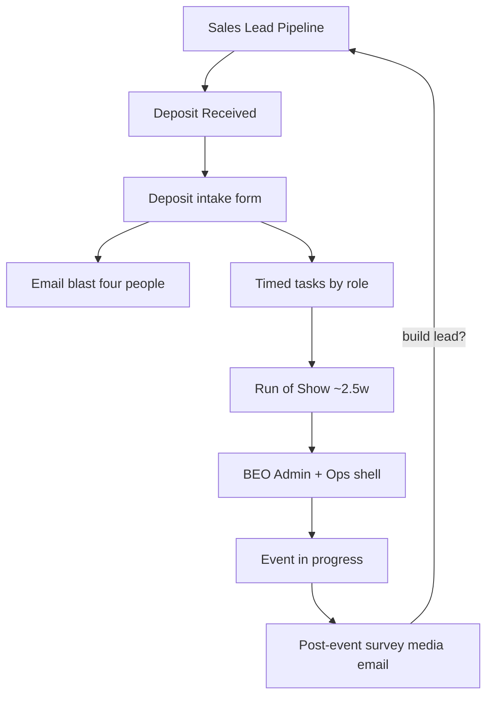

# Event Operations Workflows — Overview

*Synced Aug 22, 2026 with [meeting.md](../BEO_System_docs/meeting.md), [Copy of _In-Person Cooking.md](../BEO_System_docs/Copy%20of%20_In-Person%20Cooking.md), [Vendor Directory.md](../BEO_System_docs/Vendor%20Directory.md), and all experience docs in `BEO_System_docs/`.*  
*Auditable cooking checklist: [COOKING-TRACEABILITY.md](./COOKING-TRACEABILITY.md).*

---

## 1. One-paragraph answer

Mangia DC’s **sales CRM** takes a lead to deposit. After deposit, ops still runs events from Google Docs / Slack / FareHarbor / Drive. This project turns the post-deposit process into a **clickable CRM workflow**: every cooking checklist line becomes a **task or field** with owner, due date, and resource links, prefilled from the lead/event.

---

## 2. Conflict rules (locked)

1. **Cooking checklist detail** → Cooking.md is the exhaustive seed for In-Person Cooking (see traceability).
2. **Meeting product decisions** override hedges in older drafts:
   - Retire **Slack Sales Alert** as a required step → **email blast to Dave, Zach, Monica, Eileen**
   - Slack channel URL may remain an **optional resource** only
   - **Flavors of DC / warm meal** = **shared** food add-on (any experience); sauces / mystery ingredients stay cooking-only
   - Deposit amount viewers: **Dave, Zach, Monica only**
   - Full BEO PDF generator deferred; WhatsApp automation deferred; recruiting = Onboarding System
3. **Other experience docs** are source for that experience. If a file is still a Cooking/Paint clone with wrong inventory → plans say **incomplete — flag Zach**, do not invent SKUs.
4. **ROS timing:** cooking doc **~2.5 weeks** (email client / schedule ROS).
5. **Vendor contacts** (phones, emails, addresses, use-notes) → local [`Vendor Directory.md`](../BEO_System_docs/Vendor%20Directory.md) wins. Keep the Google Drive Vendor Directory link as a convenience resource only. Cooking SKU purchase URLs still come from Cooking.md + Inventory Links.

---

## 3. What already exists (extend, don’t rebuild)

| Piece | Location |
|-------|----------|
| Lead → Event | [`createEventFromWonLead.ts`](../server/services/leads/createEventFromWonLead.ts) |
| Thin hardcoded workflows | [`generateWorkflow.ts`](../server/services/events/generateWorkflow.ts) |
| Event schema | [`events.ts`](../server/db/schema/events.ts) |
| Post-event draft | [`postEventAutomation.ts`](../server/services/events/postEventAutomation.ts) |

---

## 4. End-to-end picture

---

## 5. Two timeline families

**Meeting-first (Aug 19):** Dave/Zach — most nitty-gritty is the same across experiences; **inventory** is the main delta; ROS “confirm menu” becomes confirm painting / cocktails / itinerary / etc. Family B docs that omit ROS are **superseded** for product: ROS is shared.

### Family A — Cooking (full depth)

Upon deposit → **~2.5 weeks** email client + schedule ROS → **ROS meeting** → **1 week** marketing print/QR + inventory order → **72–48h** BEO staff check-in → apron clean/pickup + remaining supplies → **24h** triple-check + ice → day-of → post.

Phases enum: `upon_deposit` | `two_point_five_weeks` | `ros` | `one_week_before` | `staff_checkin_72_48h` | `twenty_four_h` | `during` | `post`

### Family B / C — shared ROS + experience deltas

All matrix experiences get **shared ROS** (~2.5w schedule + ROS checklist with experience `rosConfirmLabel`). Inventory order follows **after** ROS (~1w). Family B keeps 3w staff / 2w finalize extras; Family C keeps collapsed 1w inventory for stubs. Tours/Flavors still add multi-stop logistics. Stubs: flag Zach — do not invent SKUs.

---

## 6. Shared vs cooking-specific

**Shared across experiences**

- Prefill: date, start time, company, contact, experience, headcount range, deposit (restricted), venue, transport
- Deposit email blast (Dave / Zach / Monica / Eileen)
- FareHarbor item (+ how-to video)
- Admin BEO + Ops BEO shell + FH link
- Instructor + event team outreach immediately (48h policy)
- Venue / loading dock
- Custom add-ons: aprons, glassware, boards (25 min), chocolate mold, chef hats, berets, amounts optional, logo ordered
- **Flavors of DC / warm meal** as shared food add-on
- Alcohol / bar block (where applicable)
- Transportation (**Sammy Transport** / **DC Nation Tours**; Alberto = Sammy contact)
- **Run of Show (~2.5 weeks)** + confirm-X label by experience
- Post-event: survey, media, thank-you drafts, EMAIL 2, optional new lead

**Cooking-specific (Family A)**

- Competition vs cooking; dish configuration; mystery ingredients; alternative sauces
- Cooking inventory SKUs (see plan 04 + traceability C070–C088)
- Recipe cards / menu tents / bar menu / QR week-before marketing checklist
- 24h ice/triple-check depth

---

## 7. Roles

| Role | Typical ownership |
|------|-------------------|
| Sales | Intake meeting, deposit fields, thank-you / EMAIL 2 / new lead |
| Admin | FH item, participation (Sheets\|Forms), survey URL, CRM workflow link, **BEO**, ROS template |
| Ops | Staff outreach, dock, 2.5w email, ROS, inventory, BEO shell + staff BEO email, check-in, 24h |
| Marketing | Recipe cards, chef verify, paper, print, QR (create/website/print), tents, bar menu |
| Event Host | Day-of BEO, handbook, POC, speakers, media, consumption, debrief |
| Intern | Optional assignee on 24h triple-check (with Ops Manager) |

Deposit amount: **Dave, Zach, Monica only**.

---

## 8. Doc quality matrix (non-cooking)

| Doc | Timeline | Quality | Notes |
|-----|----------|---------|-------|
| Paint & Sip | Family B | Complete-ish | Out-of-town canvas; scissors/easels on BEO |
| Pottery | Family B | **Incomplete** | Paint clone + clay note — flag Zach for kiln |
| Lend a Hand | Family B | **Incomplete** | Materials placeholder |
| Terrarium | Family B | Complete-ish | Plant inventory; kit ship; remaining balance @2w |
| Flavors of DC | Family B | Complete process | Early participant list; multi-stop ops; venues omit Foundry/1015 |
| Monuments | Family B | Complete process | Tour kit; multi-stop; mailed BEO |
| Private Food Tour | Family B | Complete process | + drinks 0–4 @2w |
| Mixology | Collapsed 1w | **Stub** | 2001 K ST; inventory still cooking — flag Zach |
| Chocolate Making | Collapsed 1w | **Stub** | Cooking clone |
| Chocolate & Wine | Collapsed 1w | **Stub** | Truncated cooking inventory |
| Cheeseboard | Collapsed 1w | **Stub** | Cooking clone |
| Gingerbread | Collapsed 1w | **Stub** | Cooking clone |

---

## 9. Phased plans

| # | File | Goal |
|---|------|------|
| — | [COOKING-TRACEABILITY.md](./COOKING-TRACEABILITY.md) | Line-by-line cooking audit |
| 01 | [01-event-workflow-foundation.md](./01-event-workflow-foundation.md) | Templates, phases, resources, Admin BEO vs Ops shell |
| 02 | [02-deposit-intake-and-crm-sync.md](./02-deposit-intake-and-crm-sync.md) | Prefill + full deposit intake |
| 03 | [03-task-timeline-and-roles.md](./03-task-timeline-and-roles.md) | Timed tasks, email blast, marketing/apron sub-checks |
| 04 | [04-inventory-and-vendors.md](./04-inventory-and-vendors.md) | Exact cooking SKUs + Vendor Directory seed (transport, Basecamp, glassware, embroidery, olive oil) |
| 05 | [05-run-of-show-and-beo.md](./05-run-of-show-and-beo.md) | ROS form + BEO split |
| 06 | [06-during-and-post-event.md](./06-during-and-post-event.md) | Day-of + post + LinkedIn + T-shirt |
| 07 | [07-multi-experience-templates.md](./07-multi-experience-templates.md) | Doc-accurate multi-experience matrix |
| 08 | [08-venues-and-catalog-admin.md](./08-venues-and-catalog-admin.md) | Editable venues (lead↔event sync) + inventory catalog / checklist CRUD |

Build order: **01 → 02 → 03 → 05 → 04 → 06 → 07 → 08**.

---

## 10. Explicitly out of scope (early phases)

- Full automated BEO PDF generation (Zach session later)
- FareHarbor write API (checklist + video)
- WhatsApp / Meta Business API send (manual task now)
- Recruiting / tour-guide / instructor hiring (Onboarding System)

---

## 11. Success criteria (v1 = Cooking Family A)

1. Every row in COOKING-TRACEABILITY is implementable as field/task/resource.
2. Deposit intake complete → cooking tasks generated; email blast to four people (no required Slack step).
3. Marketing week-before sub-checklist is complete (chef verify, paper, print, QR trio, tents, recipe cards, bar menu).
4. ROS answers stored; Admin BEO + Ops shell both tracked.
5. Post-event V1/V2 drafts, EMAIL 2, LinkedIn, +3mo T-shirt, optional new lead.
6. Inventory seed matches cooking SKUs including cocktail napkins and 3rd-party furniture.
