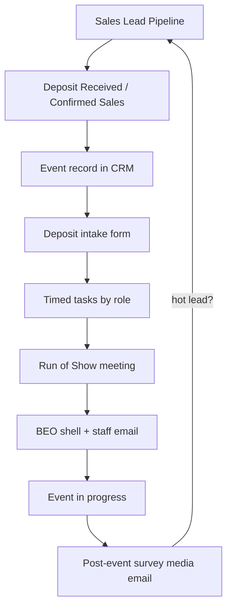

# Event Operations Workflows — Overview

*Written Aug 22, 2026. Sources: [BEO_System_docs/meeting.md](../BEO_System_docs/meeting.md), [Copy of _In-Person Cooking.md](../BEO_System_docs/Copy%20of%20_In-Person%20Cooking.md), and the other experience workflow docs in `BEO_System_docs/`.*

---

## 1. One-paragraph answer

Mangia DC already has a **sales CRM** that takes a lead from inquiry → deposit. Once a deposit is paid, ops still runs the event out of **Google Docs / Slack / FareHarbor / Drive**. Dave and Zach want that post-deposit process turned into a **clickable workflow inside the CRM**: every checkbox in the cooking (and sibling) docs becomes a **task with owner, due date, and links**, prefilled from the lead/event, so Monica / Zach / Marketing / Sales stop double-entering data and nothing slips through the cracks.

> **Zach (meeting):** Inventory is the main thing that differs per experience; scheduling, BEO call, staff outreach, venues, instructor flow are mostly the same across experiences.

---

## 2. What already exists in Mangia CRM (do not rebuild blindly)

| Piece | Location | Status vs BEO docs |
|-------|----------|--------------------|
| Lead → Event on Won / Confirmed Sales | [`createEventFromWonLead.ts`](../server/services/leads/createEventFromWonLead.ts) | Creates event + short checklist; **not** the full cooking workflow |
| Hardcoded per-type task lists | [`generateWorkflow.ts`](../server/services/events/generateWorkflow.ts) | Thin / outdated vs Aug 19 cooking doc |
| Event schema | [`events.ts`](../server/db/schema/events.ts) | Already has venue, alcohol, transport, customAddons, beoLink, fareharborLink, inventoryStatus, POC, stages |
| Post-event thank-you draft | [`postEventAutomation.ts`](../server/services/events/postEventAutomation.ts) | Partial; missing photo pack + sales follow-up variants |
| Staff assignment | [`assignEventStaff.ts`](../server/services/events/assignEventStaff.ts) | Exists; needs tighter “48h respond” policy UX |

**Principle:** Extend the event + tasks system. Do **not** invent a second parallel “BEO app.” Cooking doc = source of truth for v1 template completeness.

---

## 3. End-to-end picture

**Sales CRM** (already built) ends at deposit.  
**Event workflow** (this project) starts at deposit and runs through post-event + optional new lead.

---

## 4. What the docs actually contain (three kinds of stuff)

Same pattern as onboarding handbook — separate them:

| # | Kind | Example | What we build |
|---|------|---------|---------------|
| 1 | **Process** | Deposit → Slack → FH → BEO → staff → ROS → inventory → day-of → post | Task templates, stages, owners, due offsets |
| 2 | **Config / preferences** | Alcohol, competition, dish config, add-ons, venue, transport | Event fields + deposit intake UI (dropdowns, not free text where possible) |
| 3 | **Resources** | Vendor Directory, inventory Amazon links, how-to videos, survey Form, email copy | Links / attachments on tasks; vendor + inventory tables later |

Handbook-style prose (Company Handbook links, talk tracks) = reference resources, not separate apps.

---

## 5. Roles (from cooking doc + meeting)

| Role in docs | CRM mapping | Typical ownership |
|--------------|-------------|-------------------|
| Sales | Sales | Deposit intake fields, Slack alert, post-event thank-you / referral emails |
| Administrative Assistant / Admin | Admin | FareHarbor item, participation list, survey link, workflow link, BEO shell stubs |
| Operations Manager | Ops | Staff outreach, venue/loading dock, ROS, inventory, BEO email to staff, ice, staging |
| Marketing Associate | Marketing (map to Admin or new role if needed) | Recipe cards / menus, QR codes, menu tents |
| Event Team Lead / Host / Instructor | Event Host | Day-of execution, consumption tally, media upload, team debrief into survey |
| Intern | Ops support | 24h inventory triple-check assist |

Each task must answer Zach’s three questions: **Who? When (relative to event date)? How long / how?**

---

## 6. Shared vs experience-specific (Zach’s rule)

**Shared across (almost) all experiences**

- Prefill from CRM: date, start time, company, contact, experience, headcount range, deposit amount (restricted), venue, transport
- Slack / email blast on deposit (replace double Slack work over time)
- Create FareHarbor item (+ how-to video link)
- BEO shell + link to FH / CRM event
- Reach out instructor + event team **immediately** (48h response policy)
- Venue / loading dock
- Run of Show (~2.5 weeks out) + calendar invite
- Custom add-ons block (aprons, glassware, boards, hats, berets, chocolate mold, etc.)
- Alcohol / bar block
- Transportation (Alberto / DC Nation)
- Post-event: survey, media, thank-you email variants, optional new lead

**Cooking-specific (v1 reference)**

- Competition vs cooking experience
- Dish configuration: entree | app+entree | app+entree+dessert
- Food additions: charcuterie, protein side, mystery ingredients, sauces, Flavors of DC / warm meal
- Cooking inventory list (Sterno, butane, parchment, olive oil from Gtown Olive, etc.)
- Recipe cards / menu tents / QR (marketing week-before)

**Other experiences** — same skeleton; swap inventory + a few confirm steps (e.g. Paint & Sip = canvas size / painting confirm; Mixology = cocktails). Docs live in `BEO_System_docs/`.

---

## 7. Experience docs in the repo

| Doc | Use |
|-----|-----|
| `Copy of _In-Person Cooking.md` | **v1 reference template** (richest) |
| Paint & Sip, Mixology, Chocolate Making, Chocolate & Wine, Cheeseboard, Gingerbread, Terrarium, Pottery, Lend a Hand, Monuments, Private Food Tour, Flavors of DC | Phase 7 — derive templates from cooking + inventory deltas |
| `meeting.md` | Requirements / intent from Dave & Zach |

---

## 8. Phased plans (read in order)

| # | File | Goal |
|---|------|------|
| 01 | [01-event-workflow-foundation.md](./01-event-workflow-foundation.md) | Data model: workflow templates, task defs, event config JSON, stages |
| 02 | [02-deposit-intake-and-crm-sync.md](./02-deposit-intake-and-crm-sync.md) | Prefill from lead; deposit intake form; restricted deposit amount; fire workflow |
| 03 | [03-task-timeline-and-roles.md](./03-task-timeline-and-roles.md) | Generate timed tasks; role queues; 48h staff policy; email/Slack alerts |
| 04 | [04-inventory-and-vendors.md](./04-inventory-and-vendors.md) | Inventory checklist + vendor directory links (user-updatable URLs) |
| 05 | [05-run-of-show-and-beo.md](./05-run-of-show-and-beo.md) | ROS meeting fields; BEO shell links; staff BEO email |
| 06 | [06-during-and-post-event.md](./06-during-and-post-event.md) | Day-of stage; survey; media; thank-you templates; build next lead |
| 07 | [07-multi-experience-templates.md](./07-multi-experience-templates.md) | Port other BEO docs; inventory-only deltas |

**Recommended build order:** 01 → 02 → 03 → 05 (thin) → 04 → 06 → 07.

---

## 9. Explicitly out of scope for early phases

- Full automated BEO PDF generation (Zach session later; store shell URL for now)
- FareHarbor write API if none exists (keep “create FH item” as checklist + video)
- WhatsApp / Meta Business API for staff media (track as task + link; automate later)
- Full recruiting lifecycle / tour-guide onboarding (separate Onboarding System)
- Replacing FareHarbor calendar for staff who already get email video

---

## 10. Success criteria (v1 = Cooking only)

1. Deposit / Confirmed Sales creates Event and **full cooking workflow tasks** (not the short DEFAULT_CHECKLIST alone).
2. Sales can complete deposit intake (alcohol, venue, add-ons, headcount range, etc.) without Slack as the system of record.
3. Ops / Admin / Marketing see role-filtered task lists with due dates relative to `eventDate`.
4. Run of Show answers are stored on the event and visible to BEO prep.
5. Post-event thank-you draft uses sales copy variants; option to open a follow-up lead.
6. Inventory checklist for cooking shows preferred purchase links (editable later).

---

## 11. Open follow-ups with Zach / Dave (do not block 01–03)

- Exact BEO shell structure (separate session)
- Confirm Marketing role in CRM users / permissions
- Deposit amount visibility (Monica + Zach only)
- Which Slack channel members get the deposit blast vs email-only to Dave/Zach/Monica/Eileen
- Example “Dave ChatGPT survey” emails for intake quality (sales survey separate workstream)

---

## 12. How to use this folder

1. Read this overview.
2. Implement plans **in number order**; each plan ends with a checklist.
3. Keep `BEO_System_docs/` as human source; code templates should mirror cooking first.
4. When a doc conflicts with the meeting (e.g. ROS timing), prefer the **Aug 19 meeting + updated cooking copy**.
